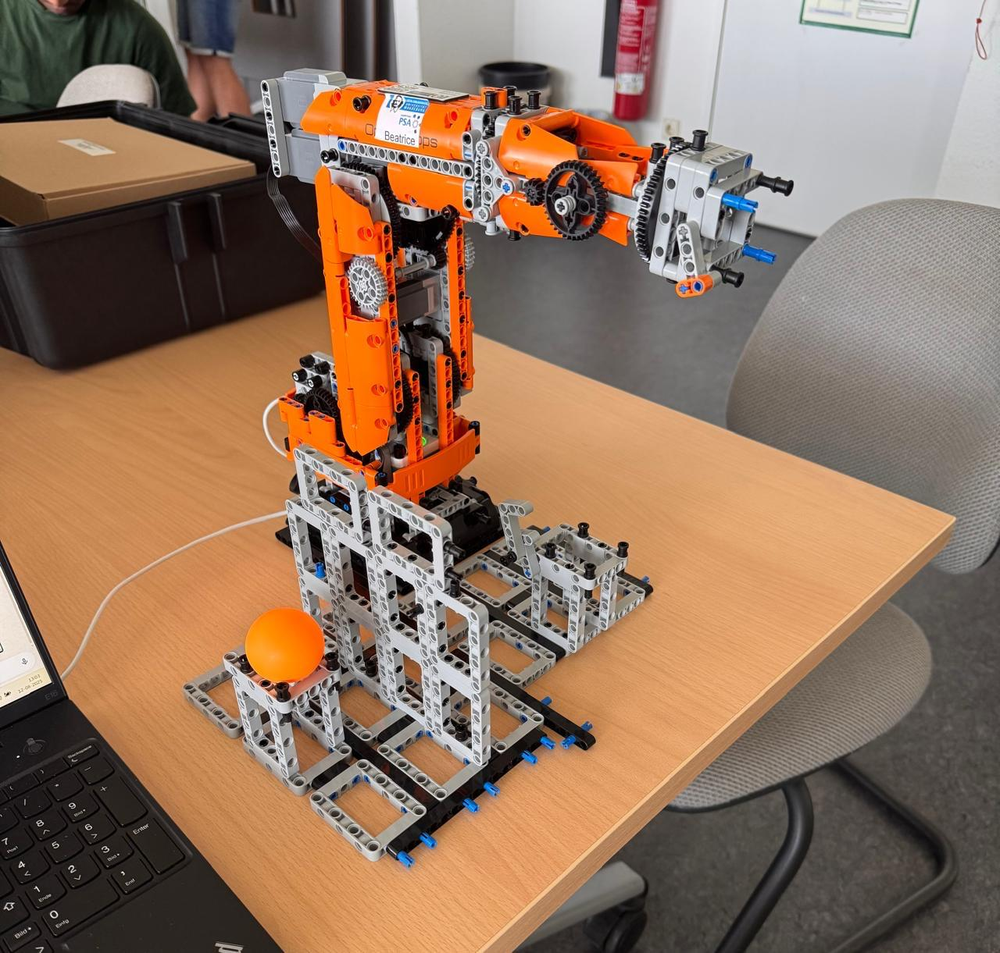

# 🤖 KUKA Robotic Pick & Place with IIoT Integration

-orange)

---

## 📌 Overview
This project demonstrates the **programming, simulation, and IIoT integration** of a **KUKA ERS 3.0 robotic arm** to perform a **Pick & Place task**.  

Developed during my **Robotics Programming & Operation Internship at OVGU (May 2025 – Ongoing)**, the system goes beyond basic robot control by enabling **remote operation via OPC-UA and Python**, showcasing how robotics can be seamlessly integrated with **Industry 4.0 technologies**.

---

## ⭐ STAR Contribution

**Situation**  
Automating a Pick & Place task on a 6-axis KUKA ERS 3.0 robot, with the additional challenge of enabling **remote IIoT control**.  

**Task**  
- Program the robot for a **precise pick-and-place sequence**.  
- Validate through **offline simulation** before deployment.  
- Extend functionality with **OPC-UA & Python client-server** for remote multi-user access.  

**Action**  
- Programmed robot in **KUKA Robot Language (KRL)** on the KUKA Robot Controller (KRC).  
- Simulated motion using **RoboDK** with imported WRL/STEP models.  
- Integrated **OPC-UA server** for connectivity and developed a **Python client-server system** for remote operation.  
- Configured **SmartHMI/SmartPAD** interface for on-site programming and testing.  

**Result**  
- Delivered a **functional Pick & Place cycle**, validated both in simulation and on a **physical LEGO-based KUKA ERS 3.0** robot.  
- Successfully enabled **remote, multi-user robot operation** via OPC-UA.  
- Demonstrated strong skills in **robotics programming, IIoT integration, PLC systems, and automation**.  

---

## 🖼️ Project Highlights

| Stage | Image |
|-------|-------|
| **1. RoboDK Simulation** |  |
| **2. SmartPAD & KRL Programming** |  |
| **3. Physical Robot Execution** |  |

---

## 📂 Repository Structure

---

## 📑 Reports & Documentation
- 📕 **Guide Report (PDF):** [KUKA_PickPlace_Guide.pdf](docs/reports/KUKA_PickPlace_Guide.pdf)

---

## 💻 Source Code
- 📝 **KUKA Pick & Place Program:** [kuka_pick_and_place.src](src/kuka_pick_and_place.src)

---

## 📹 Demo Video
- 🎥 [Watch Demo Video](media/kuka_pick_place_demo.mp4) 

---

## 🗂️ CAD Models
Full CAD package (WRL, STEP, IGES) is published as a Release for easy download:

👉 [Download Full CAD Models (ZIP)](../../releases/latest/download/KUKA_ERS3.0_FullModels_v1.0.zip)

---

## 🛠️ Tools & Technologies
- **KUKA Robot Language (KRL)**  
- **KUKA Robot Controller (KRC)**  
- **RoboDK (offline simulation & programming)**  
- **OPC-UA (Industry 4.0 integration)**  
- **Python Client-Server (remote control)**  
- **SmartHMI / PLC Interfaces**  

---

## 🔑 Key Takeaways
- Combined **simulation, programming, and real-world validation** in one project.  
- Showcased **Industry 4.0 readiness** by linking robotics with OPC-UA and remote Python control.  
- Delivered a **documented, working robotic system** bridging traditional automation and modern IIoT.  

---

## ⚖️ License
Distributed under the [MIT License](LICENSE).
